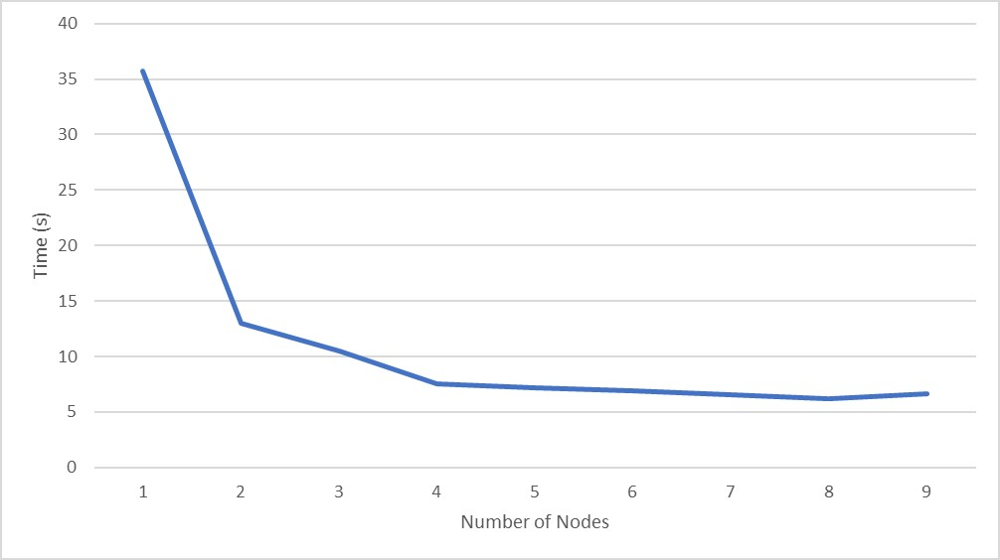

Name: Eva Nolan
Student Number: 14335043

Program is run using the start.sh script provided. Library requirements are radon and requests.

The aim of this project was to compute the average cyclomatic complexity of all the python files in a each commit for a github repository. This was to be done efficiently through the use of a master and a number of worker nodes. The project is written in python and through the use of socket programming

The master node gets the sha of each commit in the repo using the lib. When a worker starts up it sends a message to the master node requesting work. The master responds with an sha key. The worker pulls each python file in this commit and gets its cyclomatic complexity. It computes the average and returns it to the master. When this is finished it sends a message to the master requesting more work. When there are no more commits to send the master responds to request for work with a done message and the worker nodes shut down.

The time taken for the cyclomatic complexity for the entire repository to be calculated was taken when the code was run with one worker to nine. A point was reached at about four or five nodes where adding more nodes made very little difference to the overall calculation time. The graph is shown below

